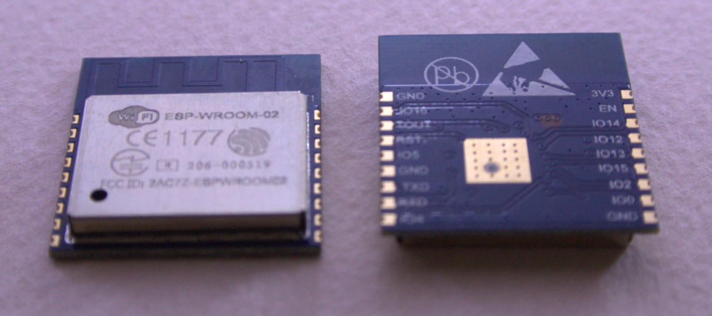
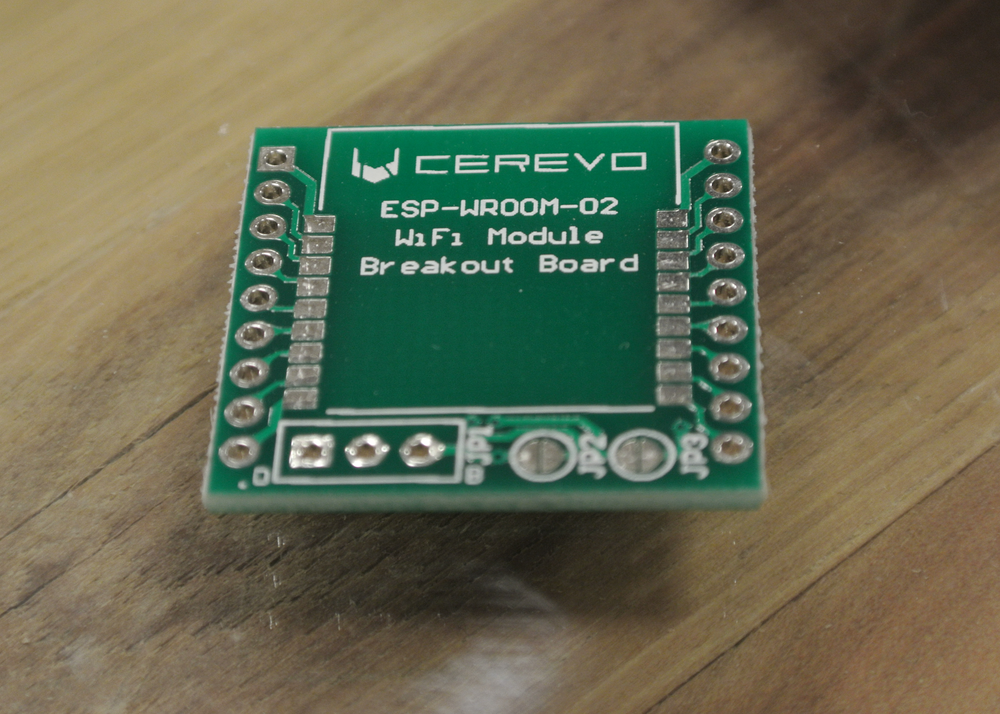
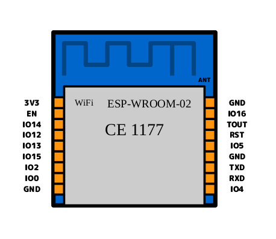

===============================================
博士の ESP-WROOM-02 実験室
===============================================

噂のESP-WROOM-02を博士なりに解析＆実験を行うサイトです。

まずは、ESP-WROOM-02の資料まとめを行い、そのうち自作基板にのせる予定です。

ここではESP-WROOM-02をATコマンドにより外部マイコンにて制御する方法をご案内しております。

.. toctree::
    :maxdepth: 2
 
    ATSmple
    ATcommand
    PDF

ESP-WROOM-02の購入
-----------------------------------------------------------------

ESP-WROOM-02の購入は、

:秋月電子通商: http://akizukidenshi.com/catalog/g/gM-09607/
:スイッチサイエンス: https://www.switch-science.com/catalog/2346/
:共立エレショップ: http://eleshop.jp/shop/g/gF7F323/

などで購入できます。

また、変換基板も取り扱っている場所もございます。

:Cerevo: http://cerevo.shop-pro.jp/?pid=91592223

:スイッチサイエンス: https://www.switch-science.com/catalog/2362/
:スイッチサイエンス: https://www.switch-science.com/catalog/2347/
:スイッチサイエンス: https://www.switch-science.com/catalog/2363/
:スイッチサイエンス: https://www.switch-science.com/catalog/2341/

提供
^^^^^^^^^^^^^^^^^^^^^^^^^^^^^^^^^^^^^^^^^^^^^
ArtifactNoise.

管理情報
^^^^^^^^^^^^^^^^^^^^^^^^^^^^^^^^^^^^^^^^^^^^^

:初版: 2015/08/09

:作成者: Yuta kitagami
:連絡先: kitagami@artifactnoise.com
:twitter: @nonNoise